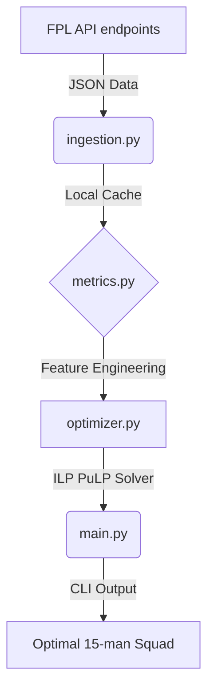

# 📋 FPL Squad Optimizer

An Integer Linear Programming (ILP) based command-line tool that selects the mathematical optimum Fantasy Premier League (FPL) squad given your budget and constraints.

## 🏗️ Architecture

The application follows a modular CLI-to-Core design, separating data acquisition, mathematical optimization, and the presentation layer.



## 🧮 Mathematical Formulations

The engine relies on deterministic metrics to maximize returns:

1.  **Form Weighting:** An exponentially decaying moving average of points over the last 4 gameweeks to capture recent momentum accurately.
    *   $\text{EMA Score} = \sum_{i=1}^{n} w_i \cdot \text{Points}_i$
2.  **Fixture Discounting:** A player's raw point potential is adjusted using the upcoming Fixture Difficulty Rating (FDR).
    *   $\text{Projected Points} = \text{EMA Form} \times \text{FDR Multiplier}$
3.  **Value Metric:** Points per pound efficiency.
    *   $\text{Value} = \frac{\text{Projected Points}}{\text{Cost}}$

### The Optimization Engine

The squad selection is modeled as a Bounded Knapsack Problem / Integer Linear Programming (ILP) problem.

**Objective Function:**
Maximize total projected squad points: $\max \sum (\text{Projected Points}_i \cdot x_i)$

**Hard Constraints:**
*   $\sum (\text{Cost}_i \cdot x_i) \le \text{Total Budget (e.g., £100.0m)}$
*   $\sum (\text{GK}_i \cdot x_i) = 2$
*   $\sum (\text{DEF}_i \cdot x_i) = 5$
*   $\sum (\text{MID}_i \cdot x_i) = 5$
*   $\sum (\text{FWD}_i \cdot x_i) = 3$
*   $\sum (\text{Team}_{c, i} \cdot x_i) \le 3 \quad \forall \text{ Club } c$

## 🚀 Installation & Usage

1.  **Clone / Setup directory:**
    Navigate to this project directory.
2.  **Create a Virtual Environment (Optional but recommended):**
    ```bash
    python -m venv .venv
    .venv\Scripts\activate
    ```
3.  **Install dependencies:**
    ```bash
    pip install -r requirements.txt
    ```
4.  **Run the Optimizer:**
    ```bash
    python -m src.main
    ```

### CLI Arguments

*   `--budget 95.0`: Set a custom total squad budget (default: 100.0).
*   `--gws 3`: Number of upcoming Gameweeks to average FDR over (default: 1).
*   `--formation 4-3-3`: Preferred starting XI formation (default: 4-4-2).
*   `--objective value_score`: Column to maximize in the solver (default: `projected_points`).
*   `--team "Arsenal"`: Show a detailed club-level dynamics report.
*   `--refresh`: Force refresh the local cached API data.

## 🧪 Testing

The solver constraints and data pipelines are verified using pytest.

```bash
pytest tests/ -v
```
